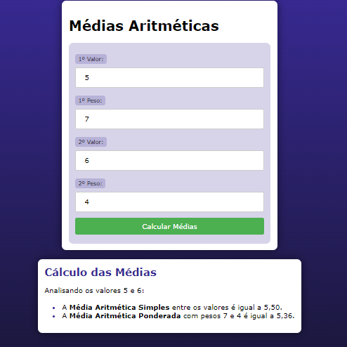

# MEDIA PONDERADA COM PHP
👨‍🏫PROJETO CRIADO PARA O CURSO DE PHP DO CURSO EM VIDEO.

 <br>

## DESCRIÇÃO:
Este aplicativo calcula duas médias: a Média Aritmética Simples e a Média Aritmética Ponderada de dois valores fornecidos pelo usuário. Além dos valores, o usuário também fornece os pesos correspondentes a cada valor para o cálculo da Média Ponderada.

- **Entrada:**
  - 1º Valor: 5
  - 1º Peso: 2
  - 2º Valor: 7
  - 2º Peso: 3

- **Saída:**
  - A Média Aritmética Simples é (5 + 7) / 2 = 6,00.
  - A Média Aritmética Ponderada é (5 * 2 + 7 * 3) / (2 + 3) = 6,20.

- **Campos Obrigatórios:** Todos os campos são obrigatórios e devem ser preenchidos.
- **Validação:** Certifique-se de inserir valores numéricos válidos.
- **Divisão por Zero:** O aplicativo trata o caso de divisão por zero na Média Ponderada, exibindo uma mensagem de erro se os pesos somarem zero.
- **Formatos de Saída:** Os resultados são formatados para exibir duas casas decimais.

## EXECUTANDO O PROJETO:
1. **Executando o Aplicativo com Apache:**
   - Coloque os arquivos em um servidor web compatível com PHP (por exemplo, XAMPP, WAMP, LAMP).
   - Acesse o formulário no navegador visitando [http://localhost/CODIGO/index.php](http://localhost/CODIGO/index.php).

2. **Executando o Aplicativo com `php.exe`:**
   - Alternativamente, você pode iniciar o servidor diretamente no diretório `./CODIGO` com o comando abaixo:
   ```bash
   php -S localhost:8080
   ```
   - Em seguida, acesse o formulário no navegador através do endereço: [http://localhost:8080](http://localhost:8080).

3. **Interagir com o Projeto:**
   1. **Abrir a Página Inicial**
      - Ao abrir a página inicial do aplicativo, você verá um formulário com campos para inserir dois valores e seus respectivos pesos.

   2. **Inserir os Valores e Pesos**
      - Insira o primeiro valor no campo "1º Valor:".
      - Insira o peso correspondente ao primeiro valor no campo "1º Peso:".
      - Insira o segundo valor no campo "2º Valor:".
      - Insira o peso correspondente ao segundo valor no campo "2º Peso:".

   3. **Enviar o Formulário**
      - Clique no botão "Calcular Médias" para enviar o formulário. O aplicativo processará os valores e pesos inseridos.

   4. **Visualizar o Resultado**
      - A página será recarregada e exibirá o resultado abaixo do formulário. O resultado mostrará:
      - A Média Aritmética Simples dos valores inseridos.
      - A Média Aritmética Ponderada dos valores, considerando os pesos fornecidos.

## CREDITOS:
- [PROJETO CRIADO PARA O CURSO DE PHP](https://github.com/VILHALVA/CURSO-DE-PHP)
- [PROJETO FEITO PELO VILHALVA](https://github.com/VILHALVA)


